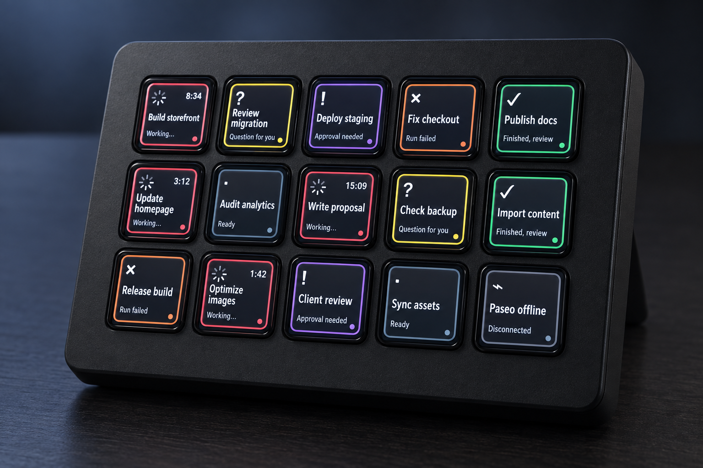

# Paseo Deck

Live [Paseo](https://paseo.sh/) agent status on a 15-key Stream Deck, using [OpenDeck](https://github.com/nekename/OpenDeck) on macOS. OpenDeck drives the hardware and handles key presses. The Paseo companion plugin provides the preferred settings screen. Both are installed on the Mac connected to the Stream Deck.



The device image is a concept render using an OpenDeck screenshot and fictional agents. The [exact key artwork](docs/mockup.png) is generated from the same renderer that runs in OpenDeck. Open [the animated browser mockup](docs/mockup.html) to see status fades, a running indicator, and page changes.

## What the keys show

Each key displays a status symbol, color rim, agent title, status text, and elapsed time while running. Titles use Avenir Next Condensed by default and up to two lines. Longer titles advance through additional pairs of lines every 10 seconds, with a moving scrollbar to show the current page. The status line stays in place. A press briefly highlights the rim. With the Paseo server ID configured below, it opens the matching agent in Paseo.

| State | Key color | Meaning |
| --- | --- | --- |
| Running | Coral | Agent is working; the timer advances. |
| Question | Yellow | The agent needs an answer. |
| Approval | Purple | A permission request needs a decision. |
| Finished | Green | Work is ready to review. |
| Failed | Orange | A run failed. |
| Idle | Slate | No current turn needs attention. |
| Offline | Gray | Paseo is disconnected. |

The left four columns show 12 agents per page. The right column has **Previous** at the top, a **current page / total pages** indicator in the middle, and **Next** at the bottom. Press the arrows to browse all visible agents. An arrow dims at the first or last page. The page indicator is informational. Agents needing attention appear first. Archived workspaces are excluded. Unused agent keys stay dark.

## Set up

Requirements: macOS, a 15-key Stream Deck, OpenDeck, Paseo, and Node.js 24 or newer to build from source. Keep OpenDeck running while you use the deck. Paseo must be reachable from this Mac for live status.

### 1. Install the OpenDeck plugin

```sh
npm ci
npm run build
ditto -c -k --sequesterRsrc --keepParent com.nerveband.paseodeck.sdPlugin paseo-deck.streamDeckPlugin
```

In OpenDeck, connect the Stream Deck, open **Plugins**, and install `paseo-deck.streamDeckPlugin`. Add **Paseo → Agent monitor** to all 15 keys to use the full display and navigation. The right column automatically becomes the page controls. Each agent action opens the agent shown on the current page; you do not enter a thread ID per key. The plugin reads the local Paseo daemon at `ws://127.0.0.1:6767/ws` by default. If the first key says **Paseo offline**, check that the daemon is running on this Mac or configure another host below.

### 2. Install the Paseo settings companion

Install the companion plugin on the same Mac. It adds a settings screen to Paseo; the OpenDeck plugin remains responsible for drawing and pressing keys.

```sh
cd paseo-plugin
npm ci
npx @getpaseo/cli@0.9.2 plugin install "$PWD"
```

### 3. Configure the appearance

In Paseo, go to **Settings → Host**, select the Mac connected to the Stream Deck, then open **Plugins → paseo-deck-settings → Paseo Deck**. Set font sizes, font family, title and status weights, letter spacing, status colors, and the text-page scrollbar position. Press **Save** to apply the changes to every Paseo key in OpenDeck. Give OpenDeck a few seconds to refresh; no separate save is needed there.

You can also select any **Agent monitor** key in OpenDeck and change the same settings in its property inspector. These are shared settings for all Paseo keys, not settings for only the selected key. OpenDeck saves a changed field automatically. Use **Reload** in Paseo to display changes made in OpenDeck. Both plugins read `~/Library/Application Support/paseo-deck/appearance.json` on this Mac.

## Open the exact agent, or add another Paseo host

For a key press to open the exact agent, create `~/Library/Application Support/paseo-deck/config.json` on the Mac and set `serverId` for the local daemon. Add more entries if you also want to show agents from another Paseo host:

```json
{
  "sources": [
    { "label": "Mac", "url": "ws://127.0.0.1:6767/ws", "serverId": "your-mac-server-id" },
    { "label": "Server", "url": "wss://your-private-host/ws", "serverId": "your-server-id" }
  ]
}
```

Find each daemon ID in its `~/.paseo/server-id` file. The ID lets a key open the exact agent. Without it, pressing a key brings Paseo forward. Use a trusted private network or `wss://` for a remote source. Restart OpenDeck after changing the source list.

## Develop

```sh
npm test
npm run build
npm run mockup
npm run typecheck --prefix paseo-plugin
```

`src/model.mjs` maps Paseo agents to states, `src/render.mjs` draws the key art, and `src/plugin.mjs` connects Paseo to OpenDeck. `scripts/mockup.mjs` generates the exact-art screenshot and HTML preview from fictional data. `paseo-plugin/` adds the Paseo settings screen and shared appearance storage.

Licensed under MIT. This is an independent community project.
