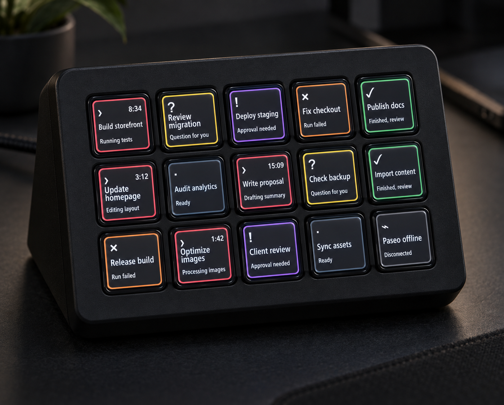

# Paseo Deck

Live [Paseo](https://paseo.sh/) agent status on a 15-key Stream Deck, using [OpenDeck](https://github.com/nekename/OpenDeck) on macOS.



The device image is a concept render using fictional agents. The [exact key artwork](docs/mockup.png) is generated from the same renderer that runs in OpenDeck. Open [the browser mockup](docs/mockup.html) for a larger preview.

## What the keys show

Each key displays a status symbol, color rim, agent title, current activity, and elapsed time while running. Titles use Avenir Next Condensed and two lines. Longer titles advance through additional pairs of lines every six seconds. Activity text moves through two-line pages. A press briefly highlights the rim and opens the matching agent in Paseo.

| State | Key color | Meaning |
| --- | --- | --- |
| Running | Coral | Agent is working; the timer advances. |
| Question | Yellow | The agent needs an answer. |
| Approval | Purple | A permission request needs a decision. |
| Finished | Green | Work is ready to review. |
| Failed | Orange | A run failed. |
| Idle | Slate | No current turn needs attention. |
| Offline | Gray | Paseo is disconnected. |

The 15 physical key positions select the first 15 visible agents. Agents needing attention appear first. Archived workspaces are excluded. Unused keys stay dark.

## Install

Requirements: macOS, a 15-key Stream Deck, OpenDeck, Paseo, and Node.js 24 or newer to build from source.

```sh
npm ci
npm run build
ditto -c -k --sequesterRsrc --keepParent com.nerveband.paseodeck.sdPlugin paseo-deck.streamDeckPlugin
```

Install `paseo-deck.streamDeckPlugin` from OpenDeck's Plugins screen. Add **Paseo → Agent monitor** to each of the 15 keys in the Default profile. Connect OpenDeck to the Stream Deck. The plugin reads the local Paseo daemon at `ws://127.0.0.1:6767/ws` by default.

For a settings screen inside Paseo, install the companion plugin on the Mac that has the Stream Deck:

```sh
cd paseo-plugin
npm ci
npx @getpaseo/cli@0.9.2 plugin install "$PWD"
```

In Paseo, select the Mac under **Settings → Host**, open **Plugins**, then choose **Paseo Deck** from the `paseo-deck-settings` actions menu. Paseo's **Save** button applies the font sizes and status colors to OpenDeck within a few seconds. OpenDeck's property inspector exposes the same settings. Use **Reload** in Paseo to see changes made in OpenDeck. Both apps share `~/Library/Application Support/paseo-deck/appearance.json` on that Mac.

## Additional Paseo hosts

To include another daemon, create `~/Library/Application Support/paseo-deck/config.json` on the Mac:

```json
{
  "sources": [
    { "label": "Mac", "url": "ws://127.0.0.1:6767/ws", "serverId": "your-mac-server-id" },
    { "label": "Server", "url": "wss://your-private-host/ws", "serverId": "your-server-id" }
  ]
}
```

Find each daemon ID in its `~/.paseo/server-id` file. The ID lets a key open the exact agent. Without it, pressing a key brings Paseo forward. Use a trusted private network or `wss://` for a remote source. Restart OpenDeck after changing the source list.

## Develop

```sh
npm test
npm run build
npm run mockup
npm run typecheck --prefix paseo-plugin
```

`src/model.mjs` maps Paseo agents to states, `src/render.mjs` draws the key art, and `src/plugin.mjs` connects Paseo to OpenDeck. `scripts/mockup.mjs` generates the exact-art screenshot and HTML preview from fictional data. `paseo-plugin/` adds the Paseo settings screen and shared appearance storage.

Licensed under MIT. This is an independent community project.
